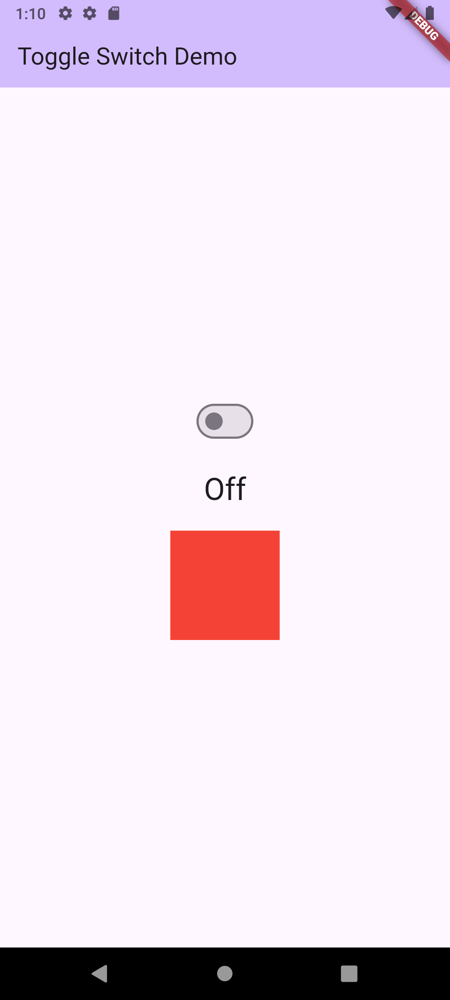
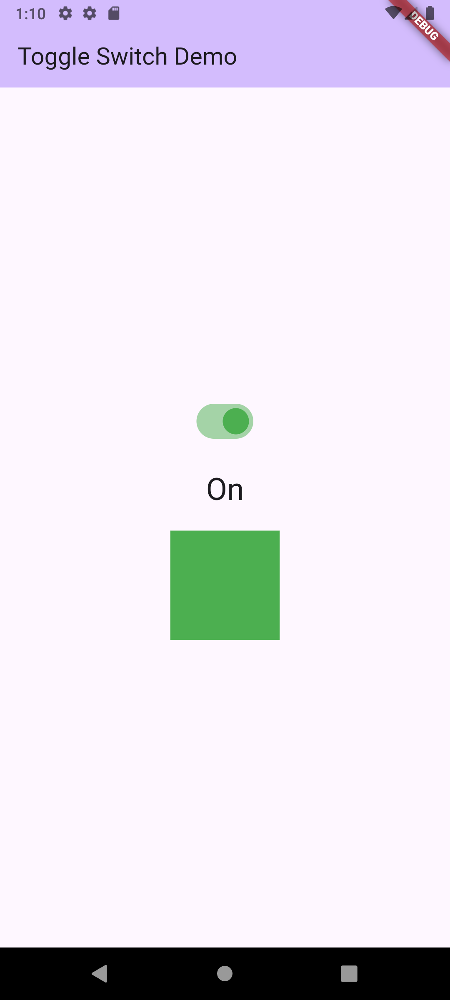

# Toggle Switch App

A simple Flutter application demonstrating the use of a `Switch` widget to control the state of other widgets. Toggling the switch changes the text content and the color of a container.

## Features

- A central `Switch` widget to toggle the state.
- A `Text` widget that displays "On" or "Off" based on the switch's state.
- A `Container` that changes its color between green ("On") and red ("Off").
- Demonstrates basic state management in Flutter using `StatefulWidget` and `setState`.

## Screenshots

Here's what the app looks like in both states.

| Off State | On State |
| :---: | :---: |
|  |  |